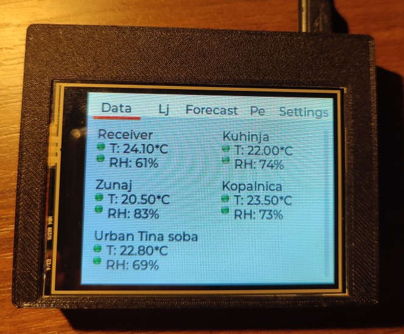
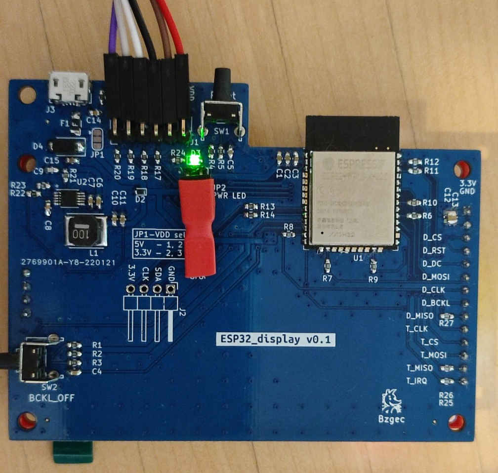

= MQTT display HW
:toc:
:sectnums:
:sectnumlevels: 4

* Current version: *0.1*
* link:./CHANGELOG.adoc[Changelog]

'''

MQTT display using:

* ESP32
* ILI9341 display

[link="./Res/pic/display_mqtt.jpg"]
.Example

== PCB:

=== v0.1

[link="./Res/pic/hw_v0.1_bottom_real.jpg"]
.HW v0.1

== Automated exporting
=== Installation
==== KiBot
link:https://github.com/INTI-CMNB/kibot#installation-using-pip[Installation]:

* `pip install --no-compile kibot`
(on Windows you probably need to install it in `KiCad Command Prompt`)

* On Arch Linux you can install it with: `paru -S kibot-git`
** You may need to install `pcbdraw-git` in case of
`module 'pcbnew' has no attribute 'PLOTTEXTMODE_STROKE'` error
(try to run `pcbnew --version` to be sure that program runs correctly)
** You also may need to install `imagemagick`: `sudo pacman -S imagemagick`
** You also may need to install few `pip` packages: `pip install mistune pybars3 wand`

==== recordmydesktop
* Needed only if running `kibot -vvv`
* Arch Linux: `sudo pacman -S recordmydesktop`

== TODO
* [ ] Fix silkscreen for programming connector (TX and RX are replaced, also the same for IO0 and RST)
* [ ] Remove Display module SD card slot - that way display can seat lower
  (whole PCB if then thinner)
